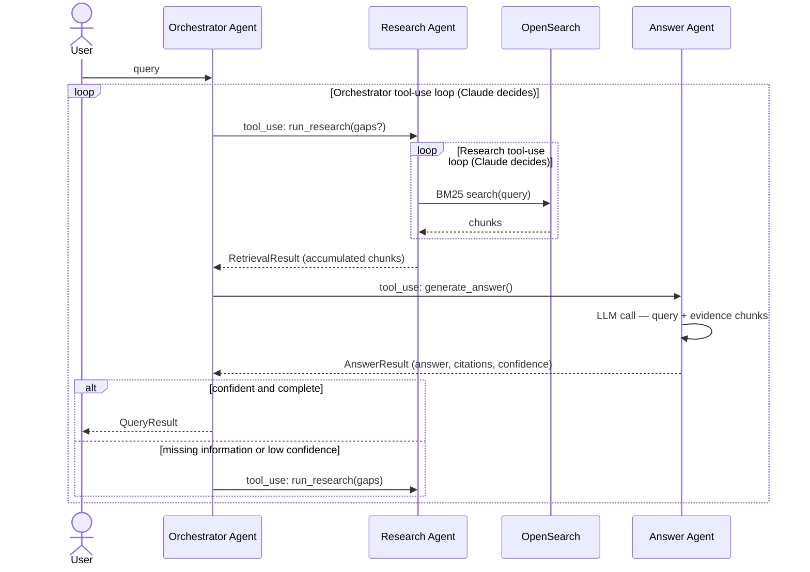

# Agents System

A multi-agent RAG (Retrieval-Augmented Generation) pipeline built with the Anthropic Claude API. Three specialised LLM agents collaborate to answer queries grounded exclusively in a knowledge base — no hallucination, citations included.

## How it works

A user query flows through three agents:

1. **Orchestrator** — an LLM agent that decides when to search, when to answer, and whether to iterate. It never retrieves or synthesises directly.
2. **Research Agent** — an LLM agent that drives OpenSearch queries via tool use until it has gathered enough evidence.
3. **Answer Agent** — an LLM that synthesises the collected evidence into a grounded answer with citations and a confidence score.

If the answer is incomplete or confidence is low, the orchestrator sends the identified gaps back to the research agent and tries again — up to `MAX_ATTEMPTS` times.



## Project structure

```
agents/
  coordinator.py   — Orchestrator Agent (LLM with run_research + generate_answer tools)
  research.py      — Research Agent (LLM with search tool)
  answer.py        — Answer Agent (single LLM call, JSON output)
  models.py        — Shared Pydantic models (AnswerResult, QueryResult)

llm/
  client.py        — Anthropic API wrapper (complete, complete_with_tools)

mcp/
  client.py        — Tool registry (list_orchestrator_tools, list_research_tools)

opensearch/
  client.py        — BM25 search client
  models.py        — RetrievedChunk, RetrievalResult

config/
  settings.py      — Typed config via pydantic-settings
  logging.py       — structlog JSON output
  display.py       — Rich terminal rendering

main.py            — CLI entry point
seed_opensearch.py — Seeds OpenSearch with the mock corpus
```

## Setup

**Prerequisites:** Python 3.12+, [uv](https://docs.astral.sh/uv/), Docker

**1. Install dependencies**

```bash
uv sync
```

**2. Configure environment**

```bash
cp .env.example .env
# Add your ANTHROPIC_API_KEY
```

**3. Start OpenSearch**

```bash
docker compose up -d
```

**4. Seed the knowledge base**

```bash
uv run python seed_opensearch.py
```

Verify data was indexed:

```bash
curl "http://localhost:9200/docs/_count?pretty"
```

## Usage

```bash
uv run python main.py "your query here"
```

## Configuration

| Variable | Default | Description |
| --- | --- | --- |
| `ANTHROPIC_API_KEY` | required | Anthropic API key |
| `MODEL` | `claude-sonnet-4-6` | Claude model to use |
| `RETRIEVAL_TOP_K` | `5` | Number of chunks returned per search |
| `OPENSEARCH_URL` | `http://localhost:9200` | OpenSearch endpoint |
| `OPENSEARCH_INDEX` | `docs` | Index name |
| `MAX_ATTEMPTS` | `3` | Max answer attempts before the orchestrator stops |
| `MAX_SEARCH_ITERATIONS` | `10` | Max tool-use iterations for the research agent |

## Development

```bash
uv run pytest          # run tests
uv run ruff check .    # lint
uv run ruff format .   # format
docker compose down    # stop OpenSearch
```
