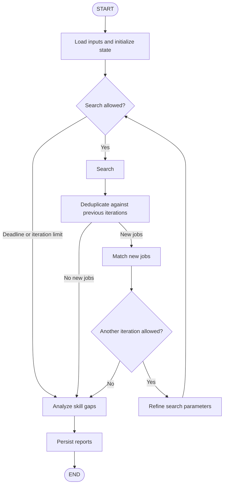
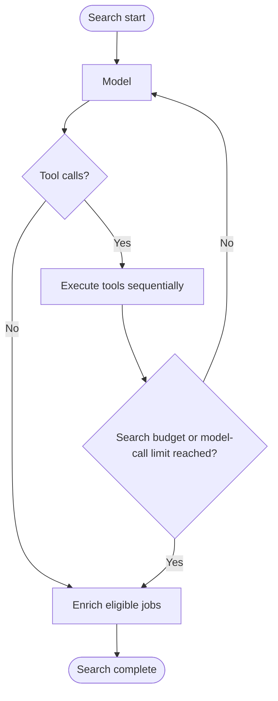

# LinkedIn Job Search Agents

A multi-agent pipeline that searches LinkedIn, scores jobs against your profile, and identifies skill gaps — all driven by Claude.

## How it works

```
.input/profile.md          ← your skills & preferences
.input/search_criteria.md  ← what you're looking for
        │
        ▼
  Coordinator (LangGraph)
  ┌──────────────────────────────────────────────┐
  │  for each iteration:                         │
  │    1. Search Agent  → scrapes LinkedIn jobs  │
  │    2. Matcher Agent → scores jobs 0–1        │
  │    3. LLM refines search params              │
  │  after all iterations:                       │
  │    4. Skills Gap Agent → categorises gaps    │
  └──────────────────────────────────────────────┘
        │
        ▼
.output/matched_jobs.md   ← ranked results with reasoning
.output/skills_gap.md     ← missing skills by category & priority
```

**Search Agent** is an LLM agent with two browser tools (`scrape_jobs`, `get_job_details`). It decides which keyword combinations and filters to try, then drives Playwright to scrape LinkedIn.

**Matcher Agent** uses LangChain structured output to score each job 0–1 against your profile in batches, returning matching/missing skills, a reason, and a recommendation. It validates that each batch receives exactly one result per job.

**Skills Gap Agent** uses LangChain `ChatAnthropic` with a Pydantic structured response to aggregate `missing_skills`, deduplicate them, and assign categories and priorities.

**Refinement** is a single LangChain model call that recommends updated search parameters as Markdown. The coordinator saves them for the next iteration.

**Coordinator** is a LangGraph workflow with deterministic routing: it loops search → match → refine, checks a soft wall-clock deadline, deduplicates jobs across iterations, and persists outputs. The search agent runs its own LangGraph model/tool subgraph.

## LangGraph migration

Steps 1–3 are implemented: LangGraph runs the outer workflow and the search subgraph.
All model calls use LangChain `ChatAnthropic`; matching and skills-gap analysis use structured
responses. Existing LinkedIn scraping functions remain the browser-tool implementations.
The CLI still calls `agents.coordinator.run()` and receives a `SearchSession`.

### Improvements after the architecture review

The graphs retain their existing nodes and edges. These changes improve the behavior inside
those nodes and the information in the report:

1. **Login failure is an error.** `search.run` raises `LinkedInAuthenticationError` when
   authentication fails. The CLI provides login guidance; result reports are not overwritten
   with an empty successful search.
2. **Enrichment preserves collected details.** `_enrich_jobs` fetches only jobs without a
   nonblank description, subject to the existing title filter. `apply_job_details` merges
   nonblank string fields, so incomplete detail responses do not erase known data.
3. **Invalid tool arguments produce feedback.** The tools node validates arguments before
   execution and returns an error `ToolMessage` for model-facing field errors. The model can
   correct its next call within the same bounded loop. Runtime failures still propagate.
4. **Refinement learns from rejected jobs.** Bounded examples from all match categories
   carry reasons. The prompt distinguishes adjustable advice from fixed URL filters.
5. **Formatting is shared.** `config/job_formatting.py` renders the same context for matcher
   input and report output. It takes an explicit description limit and has no model dependency.
6. **Settings reject invalid numeric limits.** Positive sizes and finite timeout values
   prevent invalid batch ranges and budget calculations.
7. **Reports explain each search's inputs.** `_search_jobs` appends input snapshots to
   `search_params_used`; `_to_session` passes them to the writer. Each iteration's collapsible
   section shows guidance, base criteria, and effective filters. These are inputs, not exact
   executed queries; actual tool calls appear in the execution trace. Snapshots exclude
   credentials and the profile and provide no checkpointing or resume behavior.
8. **Model setup and logging are shared.** `agents/model_client.py` provides a small factory
   and a LangChain response callback. Each component retains its prompt, schema, invocation, and parsing;
   search retains its aggregate graph metrics.

### Outer workflow (implemented)



The diamonds represent conditional-edge functions, not LLM calls or separate graph nodes.
**Search** calls `search.run()`, which opens browser resources and invokes the subgraph below.

### Search subgraph (implemented in step 3)



### What the framework owns

| Responsibility | Framework mechanism | Application logic retained |
| --- | --- | --- |
| Stage execution and looping | LangGraph nodes and conditional edges | Stop rules, iteration count, deadline policy |
| Shared workflow data | Graph state updates and Command | Job-ID deduplication and accumulation rules |
| Runtime dependencies | Runtime context and ToolRuntime injection | Browser lifecycle and ownership |
| Model/tool loop (step 3) | Explicit subgraph and ToolNode | Browser tools, prompts, budgets, sequential state handoff |
| Model calls and response parsing (step 2) | LangChain `ChatAnthropic` and structured output | Schemas, scoring rules, completeness validation |
| Model response logging | LangChain callbacks | Local trace format and metrics |
| Terminal progress | LangGraph task stream + Rich | Stage labels and presentation |
| Scraping and reporting | Existing Python functions | Login, cookies, selectors, pagination, Markdown formatting |

LangGraph executes the workflow; LangChain model/tool helpers are a separate adoption step.
LangGraph does not infer search strategy, scoring rules, or timeout policy from the graph.

### Incremental plan

1. **Outer orchestration — implemented.** Wrap existing functions in nodes, replace the
   coordinator's loop with edges, preserve reports and the CLI return type. Verify routes
   with mocked I/O before running a live search.
2. **Simple model calls — implemented.** Skills-gap analysis (step 2a), matching (step 2b),
   and refinement (step 2c) use `ChatAnthropic`. Matching validates batch coverage and score
   bounds; refinement returns Markdown from its own module.
3. **Search tool loop — implemented.** A subgraph executes model, tools, and enrichment
   nodes. Messages and tool results are local search state. Browser operations run
   sequentially on one dedicated thread; browser handles stay outside graph state.
4. **Recovery — skipped by request.** No checkpointing or resume support is planned.
5. **Cleanup and terminal progress — implemented.** Remove the unused SDK wrapper and
   direct Anthropic dependency, then stream graph task-start events into Rich stage updates.

### Step 1 walkthrough: read the code in this order

All workflow code is in `agents/coordinator.py`:

1. **`PipelineState`: the data.** A `TypedDict` describes inputs, current parameters,
   iteration count, deadline, current jobs, accumulated jobs/matches, and final gaps.
   `iteration` starts at zero and counts searches started. Lists retain the existing
   domain models; an ID-keyed representation can be introduced later if necessary.
2. **Node functions: the work.** Each function accepts state and returns a dictionary
   containing only the fields it updates. `_search_jobs` calls the existing search agent;
   `_match_jobs` calls the existing matcher. These are wrappers, not new agents.
3. **State updates: replacement.** No custom reducers are used. Returning
   `{"matched_jobs": state["matched_jobs"] + new_matches}` replaces that field with the
   complete accumulated list. Returning only `new_matches` would lose prior iterations.
   The code builds new lists rather than mutating the input state.
4. **Routing functions: the decisions.** `_can_search` checks iterations and the deadline.
   Conditional-edge functions return the next node's name. Empty or already-seen search
   results go directly to final gap analysis.
5. **`build_graph`: the wiring.** `add_node` registers the work, `add_edge` declares a
   fixed transition, and `add_conditional_edges` declares a branch. `compile()` builds
   the executable graph. Nothing calls an LLM merely to decide which stage runs next.
6. **`run`: the adapter.** Initialize state, stream the graph, then use `_to_session`
   to return the existing `SearchSession`. Reports and terminal display keep their
   existing interfaces. Logging context is cleared even if a node raises an exception.

Example with two iterations: search returns jobs A and B; matching scores both. Refinement
updates the parameters. The next search returns B and C; deduplication leaves only C for
matching. Gap analysis receives the matches for A, B, and C, and reports are written once.

Preserved behavior and current limits:

- `MAX_TOTAL_JOBS` remains a cap **per search iteration**.
- There is no refinement after the final iteration and no refinement when no new jobs
  are found. Existing saved parameters are reused; missing parameters bootstrap from criteria.
- The deadline stops new searches/refinements. An in-flight search is still followed by
  matching; final gap analysis and report writing still run after deadline expiry.
  A refinement call can overrun the deadline, so routing checks again before the next search.
- Gap analysis happens after the loop, so the refinement prompt has no computed gaps yet.
- Graph `recursion_limit` counts execution steps, not searches or elapsed seconds. `run`
  sizes it for the configured iteration count; application rules end the loop normally.
- Step 1 has no checkpointing, retries, browser concurrency, or replacement of the SDK.
  Its monotonic deadline is process-local and must be redesigned before persistent resume.

### Step 2a walkthrough: skills-gap model call

Read `agents/skills_gap.py` in this order:

1. **`SkillGapItem` and `SkillsGapResponse`: the response contract.** Python types replace
   the hand-written JSON tool schema. The outer response contains `gaps`; each item has a
   skill, category, frequency, and priority. The old parser's defaults (`Other`, `1`, `Low`)
   are preserved, and `Literal` restricts priority to the same three options as before.
2. **`ChatAnthropic`: the provider adapter.** The agent supplies the existing API key,
   `SKILLS_GAP_MODEL`, and 2,048-token limit. It is constructed only when analysis is needed.
3. **`with_structured_output`: the parsing setup.** LangChain derives a tool schema from
   Pydantic and handles extraction and validation. Explicit `method="function_calling"`
   retains forced tool output. This schema tool returns data; it is not a browser operation.
4. **`invoke`: the request.** System and human messages retain the priority rules and
   matched-job context. Only the final prompt instruction changes from the old named tool
   to the new structured response schema.
5. **Raw output and errors.** `include_raw=True` returns raw metadata, parsed data, and any
   parsing error. Token counts, call latency, and tool output still feed the execution trace.
   The agent raises parsing errors or missing structured responses rather than reporting an
   empty successful analysis. Valid `gaps=[]` is still accepted.
6. **The domain adapter.** Parsed response items are converted to existing `SkillGap`
   objects. The coordinator's graph node and report writer keep their interfaces.

Before: `complete_json` → extract tool input dictionary → `_parse` → `list[SkillGap]`.
After: `ChatAnthropic` → `with_structured_output` → validated response → `list[SkillGap]`.

Pydantic validates structure and types; it does not verify the model's skill counts or
prioritization. Those decisions remain in the prompt. Empty inputs and results with no
missing skills still return immediately without calling the model.

This step adds `langchain-anthropic`; its dependency requirements also upgrade the Anthropic
SDK in the lockfile. Step 3 also migrates the search model calls to LangChain.
Routine migration verification uses import/compilation checks and `uv run ruff check .`;
tests are added only when explicitly requested. No live API call is needed for these checks.

### Step 2b walkthrough: matcher model calls

Read `agents/matcher.py` in this order:

1. **`MatchItem` and `MatchesResponse`: the response contract.** Pydantic replaces the
   hand-written JSON schema. `score` has enforced bounds of 0–1; recommendation is one of
   the four existing labels. Optional skill lists and reason preserve their previous defaults.
   The model returns a `job_id`, not a reconstructed `JobPosting`.
2. **`run`: preprocessing.** Empty input still returns immediately. Duplicate input job IDs
   now fail explicitly because they make a one-result-per-ID contract ambiguous. The existing
   description-based dealbreaker filter still produces deterministic Skip results locally.
3. **Model setup and batching.** When jobs remain to score, create `ChatAnthropic` with the
   existing matcher model, API key, and 4,096-token limit. Reuse its structured-output wrapper
   across the existing sequential batches. If all jobs were auto-skipped, no model is created.
4. **Invocation and trace.** `invoke` receives the existing profile and formatted job
   descriptions. `method="function_calling"` retains forced tool output. `include_raw=True`
   keeps token counts, latency, and raw tool output for the trace. Parsing errors propagate.
5. **`_to_match_results`: validation and the domain adapter.** Compare returned IDs with the
   supplied batch and reject missing, unknown, or repeated IDs before accepting any results
   from that batch. Then attach each original `JobPosting` and construct the existing
   `MatchResult`. The coordinator and writers keep their interfaces.

For a batch containing jobs A and B, the response must contain A and B exactly once each.
A response containing only A, two copies of A, or an extra job C raises a descriptive error.
Previously missing results could pass unnoticed, duplicates could accumulate, and unknown
IDs were silently ignored. Scores outside 0–1 now fail Pydantic validation. These are
intentional stricter checks, not new scoring rules or automatic retry loops.

The hard-blocker prompt and scoring context are preserved; the final instruction now asks
for the structured response and explicitly includes skipped jobs. Schema and coverage checks
do not verify that the model correctly applied every blocker or assigned a good score.
The outer LangGraph topology remains the same: its `match` node calls this migrated function.

### Step 2c walkthrough: refinement module and text response

Read `agents/refinement.py`, then `_refine_params` in `agents/coordinator.py`:

1. **Module boundary.** The refinement system prompt and session-context formatter move
   out of the coordinator. `refinement.run(session, prior_params, profile_md)` returns a
   Markdown string and performs no file writes or changes to the supplied session.
2. **Context includes successes and failures.** Match counts, up to five Strong matches,
   and three each Good, Weak, and Skip examples include scores and reasons. Current
   parameters and the first 1,500 profile characters also inform the model. Effective date,
   work-mode, job-type, and configured-location settings are fixed; advice can adjust keywords,
   experience levels, and priorities among configured locations. The formatter supports
   high-priority gaps when supplied, but the current graph computes gaps after refinement.
3. **Plain model invocation.** Construct `ChatAnthropic` with the existing
   `ORCHESTRATOR_MODEL`, API key, and 2,048-token limit. Send system/human messages using
   `invoke`; there is no response schema because the required output is Markdown.
4. **Text and logging.** `response.text` extracts the text from the returned message.
   Preserve token counts, latency, and text in the execution trace. Empty text now raises
   an error before the coordinator can overwrite saved parameters; Markdown contents remain
   model-generated and are not semantically validated.
5. **Coordinator adapter.** The graph's existing `refine` node calls `refinement.run`,
   writes `.state/search_params.md`, and returns new parameter and refinement-history values.
   Conditional edges still control whether another iteration is allowed. The graph topology
   and timeout policy remain the same.

```python
# The refinement module returns text.
markdown = (_PROMPT | model).invoke({"session_context": context}).text

# The coordinator owns persistence and graph updates.
refined_params = refinement.run(session, prior_params, profile_md)
writer.save_search_params(refined_params)
return {"search_params_md": refined_params, "search_refinements": updated_history}
```

These modules are called agents in the repository, but matcher, skills gap, and refinement
are model-powered workflow steps. Search is the agent that chooses and executes tools.
Every stage is invoked by a graph node; a graph node need not contain an autonomous agent.
The unused `llm/anthropic.py` wrapper has been removed. All model calls use LangChain.
The Anthropic SDK is still installed as a dependency of `langchain-anthropic`.

### Step 3 walkthrough: search agent subgraph

Read `SearchState`, `build_search_graph`, and `run` in `agents/search.py`, then
`tools/browser_session.py`:

1. **Local state.** `SearchState` holds messages, collected jobs by ID, listing-call and
   model-call counters, token totals, and a stop reason. It is separate from the outer
   pipeline state. `search.run` returns `list[JobPosting]` to the coordinator as before.
2. **Messages reducer.** `messages` uses `add_messages`: nodes return only new messages,
   and LangGraph merges them into the conversation. Job dictionaries and counters use
   replacement updates. Tool nodes copy job objects before changing them.
3. **Model node.** `ChatAnthropic.bind_tools` makes the two typed LangChain tools available
   to Claude. The model node applies the prompt template to message history and returns an `AIMessage` plus
   usage updates. Its response can contain text, tool requests, or both.
4. **Tools node.** Execute requested calls sequentially using the existing scraper functions.
   LangChain creates each `ToolMessage` with the matching `tool_call_id`. Results update
   `jobs_by_id` through Command updates; model-generated summaries never create job records.
   A sequential adapter invokes ToolNode with the static tools in `tools/search_tools.py`.
5. **Conditional routing.** With tool requests, go from model to tools; with no requests,
   go to enrichment. After tools, repeat the model call only if the listing budget, job cap,
   and 15-model-call limit permit it. Allow the final model response's tools to execute before
   stopping at the model-call limit. This replaces the SDK's manual conversation loop.
6. **Browser ownership.** Sync Playwright is not thread-safe, and graph nodes may execute
   on different worker threads. `BrowserSession` owns a single dedicated worker: browser
   setup, login, navigation, enrichment, and cleanup execute there. `call(function, ...)`
   waits for `function(page, ...)` to complete. Logging context is copied into the worker.
   Live browser objects are supplied through typed runtime context, outside graph state.
7. **Enrichment and cleanup.** Title-based discard filtering, detail delays, per-job error
   handling remain explicit. Enrichment now skips existing descriptions and preserves
   known fields when a fetch returns incomplete data. The context manager
   closes browser resources even when the graph fails. Checkpointing remains excluded.

```text
HumanMessage → model → AIMessage(tool_calls)
                     → tools → ToolMessage(s) → model ...
                     → enrichment → actual collected jobs
```

The scrape-call budget remains `ceil(MAX_TOTAL_JOBS / MAX_JOBS_PER_SEARCH)` per outer
iteration; the model-call limit remains 15. Both tools remain available. Listing searches
check budgets before execution, including when a response asks for several tools. Once a
budget is reached, routing goes directly to enrichment rather than requiring an extra model
request to trigger the old `_LimitReached` exception. Unknown tool names return an explicit
message; browser or API failures otherwise propagate as before.

The search graph records token totals and termination reason in `llm_search_graph`;
its total latency includes login, graph execution, enrichment, and cleanup. Tool arguments,
results, and model text still appear in the trace. Construction/import/lint checks do not
exercise a live model, LinkedIn scraping, or login.

Threading reference: [Playwright library guidance](https://playwright.dev/python/docs/library#threading).

### Cleanup and terminal progress walkthrough

1. **Dependencies.** `llm/anthropic.py` had no remaining callers and is removed. The project
   no longer declares `anthropic` directly; `langchain-anthropic` supplies the SDK transitively.
2. **Execution stream.** `coordinator.run` uses `graph.stream` with `tasks` and `values` modes.
   Task-start events identify nodes as they begin; values events supply the latest graph
   state. Consume the stream to completion, then return the same `SearchSession` as before.
3. **UI boundary.** `run(on_stage=...)` accepts an optional callback receiving only a node
   name. Graph state, profiles, and descriptions are not forwarded to the display callback.
   Callers can still use `run()` without providing a callback.
4. **Rich presentation.** `main.py` translates node names through `config.display.stage_label`,
   updates the active spinner, and prints a stage line. Repeated iterations print repeated
   stages, and branches that do not run produce no stage line. Existing JSON logs and final
   results remain available. A stage line marks a start, not successful completion.

Typical one-iteration stage sequence:

```text
Loading profile and search criteria…
Searching LinkedIn and fetching job descriptions…
Removing jobs already found…
Matching jobs against your profile…
Analyzing missing skills…
Saving reports…
```

Progress covers outer pipeline stages. The search subgraph's model calls and browser details
remain in the execution trace. Streaming does not save progress: checkpointing and resume
support are deliberately excluded. This change adds no new runtime dependencies.

### Prompt templates

Each component defines `_PROMPT` with LangChain `ChatPromptTemplate` beside its existing
system instructions. The instruction wording remains a multiline string; the prompt object
represents message roles, named inputs, and composition with the model.

| Component | Template inputs | Model output |
| --- | --- | --- |
| Matcher | `profile`, `jobs` | Parsed `MatchesResponse` and raw metadata |
| Skills gap | `results` | Parsed `SkillsGapResponse` and raw metadata |
| Refinement | `session_context` | AI message containing Markdown |
| Search | `messages` via `MessagesPlaceholder` | AI message containing text/tool calls |

```python
_PROMPT = ChatPromptTemplate.from_messages([
    ("system", _SYSTEM),
    ("human", "## User Profile\n{profile}\n\n## Job Postings\n{jobs}"),
])
chain = _PROMPT | structured_model
response = chain.invoke({"profile": profile_md, "jobs": _format_jobs(batch)})
```

The pipe composes formatting followed by model invocation. Variable values are inserted
as data, so braces within profiles or job descriptions are not interpreted as additional
placeholders. Existing formatting functions still assemble detailed job/session context.
For search, `MessagesPlaceholder` inserts the actual typed conversation, preserving tool-call
IDs and message roles. Search state starts with the human request; the template supplies the
system message once per model request. Graph topology, response validation, budgets, and
trace logging stay the same. Templates remain local to their components; no new dependency
is needed because `langchain-core` is already supplied by the existing integrations.

### Runtime context, ToolNode, and sequential tool execution

Read `tools/search_context.py`, then `build_search_graph` in `agents/search.py`, then
`tools/search_tools.py`.

1. **Runtime context holds dependencies.** `SearchContext` is a frozen dataclass containing
   the browser reference. `StateGraph(SearchState, context_schema=SearchContext)` declares
   it; `invoke(..., context=SearchContext(browser=browser))` supplies it for the current run.
   Graph construction no longer captures a browser. Nodes use `runtime.context.browser`.
   Collected jobs, messages, and counters remain state. Browser ownership still belongs to
   `BrowserSession`; context adds no persistence or resume support.
2. **Tool definitions remain static.** `SEARCH_TOOLS` is created once at module import.
   `ScrapeJobsInput` and `JobDetailsInput` contain only public arguments. The functions accept
   `runtime: ToolRuntime[SearchContext]`, which `ToolNode` supplies automatically and hides
   from the model. There is no `SearchToolContext`, manual injected-argument assembly, or
   separate tool-name registry.
3. **Tools return state changes.** They read `runtime.state`, copy jobs before updating
   them, and return `Command(update=...)` containing updated jobs/counters and a `ToolMessage`
   whose ID comes from `runtime.tool_call_id`. Listing budget checks live in `scrape_jobs`,
   before browser navigation. A reached budget returns a message without collecting jobs.
4. **The graph adapter preserves ordering.** `execute_tools` invokes `ToolNode` for one
   requested call at a time. It combines each call's state updates into local working data
   before invoking the next call, then returns the final updates to LangGraph. This ensures
   that a later detail call can see jobs collected earlier in the same model response.
   Setting concurrency to one on a whole ToolNode batch would serialize execution but still
   give each call the same initial state snapshot. The adapter retains this application
   requirement while delegating dispatch, injection, validation, and replies to ToolNode.
5. **Errors remain visible.** ToolNode returns error ToolMessages for unknown tools and
   invalid arguments, giving the model feedback within its existing 15-call limit. Its
   default handler propagates other tool failures. Invalid scraped job cards raise an
   execution error rather than being reported as invalid model arguments. Invalid arguments execute no browser
   function and consume no listing budget. Title filters, detail delays, and nonblank-field
   merging are unchanged.

```python
# Browser supplied at invocation; it is not graph state.
graph = StateGraph(SearchState, context_schema=SearchContext)
compiled.invoke(initial_state, context=SearchContext(browser=browser))

# ToolNode supplies runtime; the model sees only job_url.
def get_job_details(job_url: str, runtime: ToolRuntime[SearchContext]) -> Command:
    # Fetch and merge details into a copy of runtime.state["jobs_by_id"].
    return Command(update={
        "jobs_by_id": updated_jobs,
        "messages": [ToolMessage(
            content=json.dumps(details),
            tool_call_id=runtime.tool_call_id,
            name="get_job_details",
        )],
    })
```

The sketch omits the existing scraper work; see the source for the complete implementation.
No new dependencies are needed. The outer and search graph topology remain unchanged.

References: [LangGraph runtime context](https://docs.langchain.com/oss/python/langgraph/graph-api#runtime-context),
[LangChain tools and state updates](https://docs.langchain.com/oss/python/langchain/tools).

### Model logging through callbacks

`create_chat_model` attaches a `BaseCallbackHandler` to each ChatAnthropic instance. Matcher,
skills gap, refinement, and search identify their stage when creating the model; structured
stages also provide their response schema's name. Components no longer call a response logger
explicitly after `invoke`.

- `on_chat_model_start` records a monotonic start time for the model's run ID.
- `on_llm_end` records token usage and latency from the AI message and writes the existing
  raw text or tool-output trace. Search also retains its aggregate graph metrics.
- `on_llm_error` releases the run's timing entry and records the error type. It does not
  swallow the model failure or log the exception's potentially sensitive request content.

Each model has its own handler; timing entries are protected for concurrent callbacks and
removed on completion/error. Model-call latency now starts at the framework's model-start
callback, excluding prompt formatting. Logging observes model execution; response parsing
and semantic validation remain in the individual components. A parsing error after a model
response is therefore still raised by that component, rather than treated as a model error.

References: [LangGraph graph API](https://docs.langchain.com/oss/python/langgraph/graph-api),
[LangChain structured output](https://docs.langchain.com/oss/python/langchain/models#structured-output),
[LangChain agent factory](https://reference.langchain.com/python/langchain/agents/factory/create_agent),
[LangGraph persistence](https://docs.langchain.com/oss/python/langgraph/persistence).

## Project structure

```
agents/
  coordinator.py   — LangGraph state, nodes, routing, and persistence
  refinement.py    — LangChain search-parameter advice as Markdown
  search.py        — LangGraph model/tool/enrichment subgraph
  matcher.py       — batched LangChain scoring + response validation
  skills_gap.py    — LangChain skills-gap call + structured response
  model_client.py  — shared ChatAnthropic construction and automatic logging callbacks
  models.py        — JobPosting, MatchResult, SkillGap, SearchSession

tools/
  linkedin.py      — login (cookies → credentials → manual), URL builder, scraper
  browser_session.py — one-thread runtime ownership of sync Playwright
  search_tools.py  — static LangChain tools using ToolRuntime and Command updates
  search_context.py — typed per-run browser dependency for graph nodes and tools

config/
  settings.py      — all settings via pydantic-settings + .env
  logging.py       — structlog JSON output
  display.py       — Rich terminal output
  reader.py        — load .input/ and .state/ files into the pipeline
  writer.py        — write results to .state/ and .output/
  job_formatting.py — shared job context for matcher prompts and reports

.input/
  profile.md            — your skills, experience, preferences (edit before first run)
  search_criteria.md    — base search keywords, location, filters

.state/
  search_params.md      — auto-updated each run; evolves from search_criteria.md
  cookies.json          — LinkedIn session cookies (gitignored)

.output/
  matched_jobs.md       — all matches sorted by score with reasoning
  skills_gap.md         — missing skills grouped by category, with history

main.py            — entry point
```

## Setup

**Prerequisites:** Python 3.12+, [uv](https://docs.astral.sh/uv/)

```bash
uv sync
uv run playwright install chromium   # one-time browser install
```

### Files you must create before the first run

**`.env`** — copy from `.env.example` and set your API key at minimum:
```bash
cp .env.example .env
# Required: ANTHROPIC_API_KEY
```

**`.input/profile.md`** — your skills, experience, and job preferences. The pipeline will fail with an error if this is missing.

**`.input/search_criteria.md`** — keywords, location, and filters for the initial search. The pipeline will fail with an error if this is missing.

### Optional input files

**`.input/discard_keywords.txt`** — comma-separated title keywords that cause a job to be skipped before fetching its full description (e.g. `frontend, ios, android`). If the file is absent, no jobs are discarded by title.

### Auto-generated files (do not create manually)

| File | Created by |
| --- | --- |
| `.state/search_params.md` | Coordinator, after first run — evolves from `search_criteria.md` |
| `.state/cookies.json` | Browser login flow — reused on subsequent runs |
| `.output/matched_jobs.md` | Coordinator, after each run |
| `.output/skills_gap.md` | Coordinator, after each run |

**Run**

```bash
uv run python main.py
```

## Runtime planning

Runtime depends primarily on the number of jobs whose full descriptions are fetched. Search
query count, LinkedIn pagination, matcher batch count, profile/criteria length, and Anthropic
latency are secondary factors.

The Search Agent can make at most:

```text
ceil(MAX_TOTAL_JOBS / MAX_JOBS_PER_SEARCH)
```

`scrape_jobs` calls per iteration. This limits query breadth; `MAX_TOTAL_JOBS` is a cap, not a
promise that the run will collect that many unique jobs.

### Measured runs

The first recorded Agentic AI contract search used the current 1,126-word profile and 898-word
search criteria:

| Date | Search window | Max jobs / per search | Queries | Unique / enriched jobs | Matcher batches | Total |
| --- | --- | ---: | ---: | ---: | ---: | ---: |
| 2026-09-10 | Past month, EU + Netherlands | 30 / 10 | 3 | 20 / 19 | 2 | 179.4 s (2m 59s) |
| 2026-09-10 | Past month, EU + Netherlands | 150 / 20 | 8 | 80 / 74 | 4 | 706.6 s (11m 47s) |

Current observed average: **443.0 seconds (7m 23s) across two successful measured runs**. Because
the runs inspected different numbers of jobs, the pooled end-to-end throughput of **8.9 seconds
per unique job** is more useful than the unweighted run average. Treat both as planning guides,
not guarantees; LinkedIn yield and model latency vary between runs.

Breakdown from `.output/execution_trace.log`:

| Stage | Observed time | Notes |
| --- | ---: | --- |
| Startup, cookie login, initial agent planning | 7.5 s | Existing authenticated cookie, headless browser |
| Three listing searches | 47.4 s | Individual searches took roughly 10–27 s depending on pagination |
| Enrich 19 job descriptions | 93.8 s | 4.9 s/job with `JOB_DETAIL_DELAY_MS=3000` |
| Match 20 jobs in batches of 15 + 5 | 28.6 s | 16,332 input and 2,768 output tokens across both calls |
| Skills-gap analysis and output writing | 2.0 s | One LLM call plus local Markdown writes |

The 80-job run spent 7.5 s on startup, 142.8 s on eight listing searches, 400.1 s enriching 74
descriptions (5.4 s/job), 140.4 s on four 20-job matcher batches, and 15.9 s on skills-gap
analysis/output. It produced 18 Strong, 13 Good, 2 Weak, and 47 Skipped results. Recruiter
reposts with different LinkedIn IDs mean these category counts are not counts of unique roles.

### Estimating a future run

For one search/match iteration, use this rough estimate:

```text
8 seconds startup
+ 10–30 seconds per scrape_jobs call
+ enriched jobs × (JOB_DETAIL_DELAY_MS / 1000 + about 2 seconds browser overhead)
+ 7–45 seconds per matcher batch
+ 2–20 seconds for skills-gap analysis and output
```

For the measured machine and input size, practical planning ranges are:

| Run profile | Suggested settings | Expected time |
| --- | --- | ---: |
| Quick check | 10 total jobs, 10/search, 3 s detail delay, 1 iteration | 1–2 minutes |
| Balanced deep search | 30 total jobs, 10/search, 3 s delay, batch 15, 1 iteration | 3–5 minutes |
| Larger deep search | 45 total jobs, 15/search, 3–4 s delay, batch 15, 1 iteration | 5–8 minutes |
| Broad campaign | 150 total jobs, 20/search, 3 s delay, batch 20, 1 iteration | 15–25 minutes |

Increasing `MAX_REFINEMENT_ITERATIONS` repeats search, enrichment, and matching, so two
iterations can approach twice the single-iteration runtime. `ORCHESTRATOR_TIMEOUT` is a soft
deadline checked between coordinator stages; it cannot interrupt a browser or API call already
in progress, so it should not be treated as a strict process timeout.

To update the average after future runs, record `latency_ms` from the final
`coordinator_complete` event together with query count, unique/enriched jobs, matcher batch size,
and the relevant settings. Comparing runs without those inputs is misleading.

## LinkedIn login

On first run the browser opens visibly. Log in manually — cookies are saved to `.state/cookies.json` for all subsequent runs (headless from then on).

For auto-login, set `LINKEDIN_EMAIL` and `LINKEDIN_PASSWORD` in `.env`. This may trigger MFA on the first automated attempt.

If login fails, the CLI reports a login error and exits before writing result reports.
An authenticated search that returns no jobs still produces a normal empty report.

## Configuration

Copy `.env.example` to `.env` and fill in `ANTHROPIC_API_KEY`, which is left empty in the
template. The template includes login mode, search size, iteration count, and search filters.
Model names and tuning values have defaults in `config/settings.py`; add environment
overrides only when needed. Process environment variables override `.env`, which overrides
the code defaults. Optional LinkedIn credentials are unnecessary for manual login or saved cookies.

| Variable | Default / requirement | Description |
| --- | --- | --- |
| `ANTHROPIC_API_KEY` | required | Anthropic API key |
| `ORCHESTRATOR_MODEL` | `claude-haiku-4-5-20251001` | Model for LLM search-param refinement |
| `SEARCH_MODEL` | `claude-haiku-4-5-20251001` | Model for the Search Agent |
| `MATCHER_MODEL` | `claude-haiku-4-5-20251001` | Model for the Matcher Agent |
| `SKILLS_GAP_MODEL` | `claude-haiku-4-5-20251001` | Model for the Skills Gap Agent |
| `BROWSER_HEADLESS` | `false` | Run browser headlessly (set `true` after first login) |
| `BROWSER_SLOW_MO` | `800` | ms between browser actions (anti-bot detection) |
| `LINKEDIN_EMAIL` | — | Optional: email for auto-login |
| `LINKEDIN_PASSWORD` | — | Optional: password for auto-login |
| `MAX_JOBS_PER_SEARCH` | `20` | Max job cards scraped per `scrape_jobs` call |
| `MAX_TOTAL_JOBS` | `25` | Hard cap on total jobs collected per iteration |
| `JOB_DETAIL_DELAY_MS` | `4000` | Pause between fetching each job detail page |
| `MATCHER_BATCH_SIZE` | `15` | Jobs per matcher LLM call |
| `MATCHER_DESCRIPTION_CHARS` | `7000` | Maximum description characters sent to the matcher per job |
| `MAX_REFINEMENT_ITERATIONS` | `1` | Search → match → refine loops |
| `ORCHESTRATOR_TIMEOUT` | `600.0` | Soft deadline for starting searches/refinements (seconds) |
| `SEARCH_LOCATIONS` | `Remote` | Comma-separated locations the Search Agent should cover |
| `SEARCH_DATE_POSTED` | `past_week` | URL-level recency filter |
| `SEARCH_WORK_MODES` | `remote` | Comma-separated URL-level work-mode filters |
| `SEARCH_JOB_TYPES` | `contract,temporary,part-time` | Comma-separated URL-level job-type filters |

Job limits, matcher batch size, description length, iteration count, and timeout must be
positive. Timeout must be finite. Browser slowdown and detail delay may be zero, but not
negative. Description length cannot exceed the scraper's 8,000-character cap. Pydantic
checks these constraints when settings load.

## Development

```bash
uv run ruff check .    # lint
uv run ruff format .   # format
```
