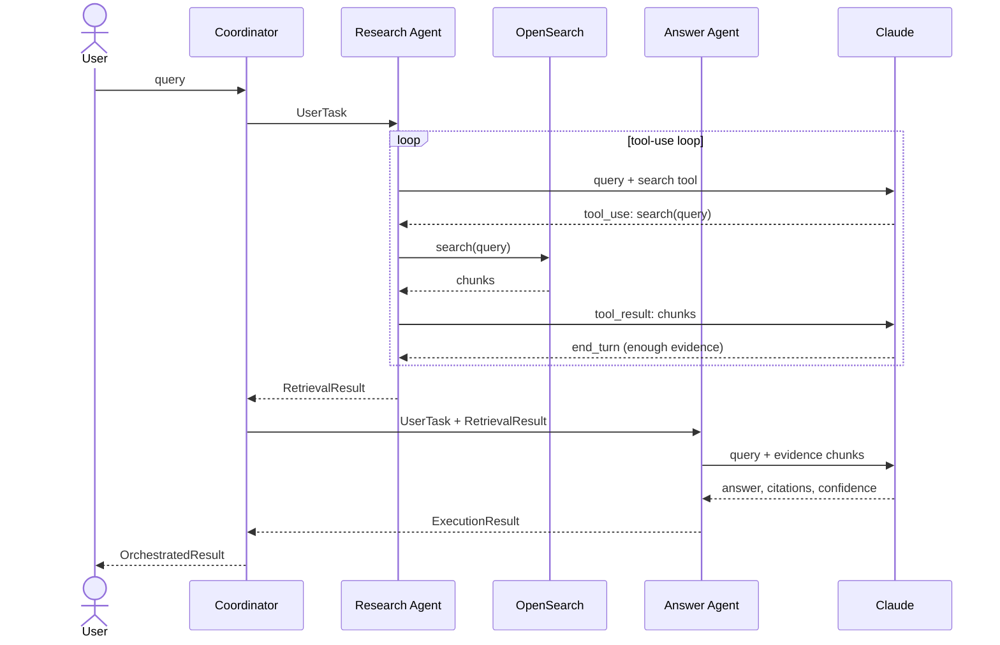

```mermaid
sequenceDiagram
    actor User
    participant Coordinator
    participant ResearchAgent as Research Agent
    participant OpenSearch
    participant AnswerAgent as Answer Agent
    participant Claude

    User->>Coordinator: query

    Coordinator->>ResearchAgent: UserTask

    loop tool-use loop
        ResearchAgent->>Claude: query + search tool
        Claude-->>ResearchAgent: tool_use: search(query)
        ResearchAgent->>OpenSearch: search(query)
        OpenSearch-->>ResearchAgent: chunks
        ResearchAgent->>Claude: tool_result: chunks
        Claude-->>ResearchAgent: end_turn (enough evidence)
    end

    ResearchAgent-->>Coordinator: RetrievalResult

    Coordinator->>AnswerAgent: UserTask + RetrievalResult
    AnswerAgent->>Claude: query + evidence chunks
    Claude-->>AnswerAgent: answer, citations, confidence
    AnswerAgent-->>Coordinator: ExecutionResult

    Coordinator-->>User: OrchestratedResult
```
