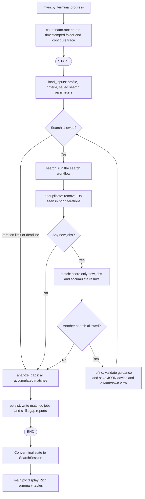

# Application workflow

The CLI calls `coordinator.run()`. LangGraph executes the outer workflow, then the CLI
displays the returned `SearchSession`. Implementation: [main.py](../main.py) and
[agents/coordinator.py](../agents/coordinator.py).

## Routing rules

- **Search allowed:** searches started are below `MAX_REFINEMENT_ITERATIONS`, and
  the process-local monotonic deadline has not passed. Despite the setting's name,
  it limits search passes; with the default of `1`, refinement does not run.
- **No new jobs:** an empty search, or results containing only previously seen job
  IDs, ends the loop and proceeds to gap analysis.
- **Refinement:** receives accumulated match examples, the profile, and current
  parameters. It returns `SearchGuidance`; the coordinator stores the object in
  graph state and saves `.state/search_guidance.json`. `.state/search_params.md`
  is a generated view, not application input.
  Location proposals can expand the search beyond `SEARCH_LOCATIONS`; they precede
  remaining starting locations without changing the matcher's geographic eligibility rules.
  Gap analysis runs later, so refinement has no computed skill gaps at this point.
- **Deadline:** checked before starting a search or refinement and again after
  refinement. It is a soft limit: an ongoing search still finishes and its new jobs
  are matched. Gap analysis and reports still run on normal completion.

Without saved JSON advice, search uses the base criteria. Refinement saves validated
advice for later runs; malformed saved JSON is an error. This saves search advice,
not interrupted-run progress; the graph has no checkpointer or resume support.

## Errors and progress

The coordinator creates a unique output folder and trace using the run's start time.
Both reports use that same timestamp and folder; previous outputs remain untouched.
The coordinator streams custom stage/progress events to the CLI and root values
events to collect the final state. It binds a session ID for logging and clears it
when the run exits.

An uncaught stage error stops the workflow before any remaining nodes execute.
The CLI handles missing inputs and failed LinkedIn authentication with guidance
and exit code `1`; other errors are displayed and re-raised. Reports are written
only when execution reaches `persist`.

Continue with the [search workflow](search-flow.md) to expand the `search` node,
or the [data flow](data-flow.md) to see the objects exchanged between stages.
