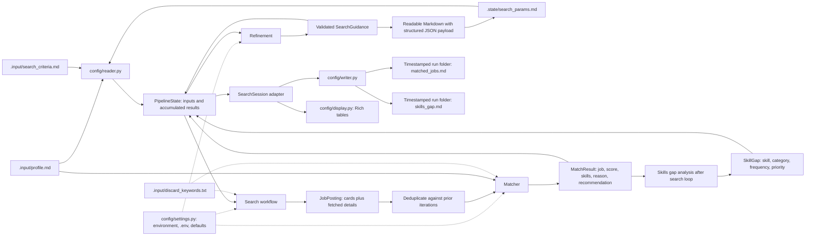
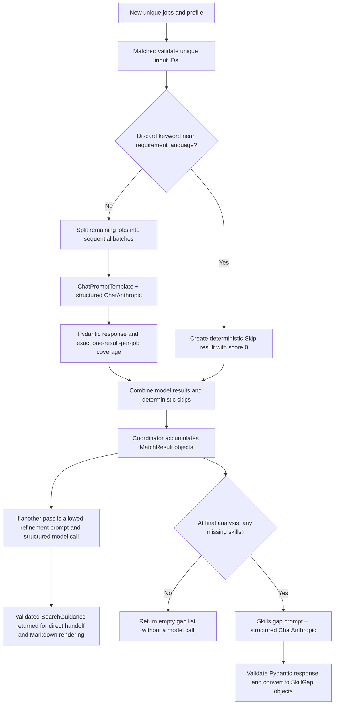

# Data and component flow

The coordinator carries inputs and accumulated results in `PipelineState`. Its
nodes return partial updates; list fields use replacement, so accumulating nodes
return the complete new list. Domain objects are defined in
[agents/models.py](../agents/models.py).

Arrows show data dependencies, not execution order. The [application workflow](application-flow.md)
controls when refinement and final analysis run. Paths shown here are defaults;
settings can override them.

## Work inside the model components

Sources: [matcher.py](../agents/matcher.py), [refinement.py](../agents/refinement.py),
and [skills_gap.py](../agents/skills_gap.py). The matcher and gap analyzer use
`with_structured_output`; their response schemas describe returned data rather
than executable browser tools. Refinement also uses structured output and returns
`SearchGuidance`; see the [refinement walkthrough](refinement-and-search-guidance.md).

Only search chooses and executes tools autonomously. Matching, refinement, and
gap analysis are model-powered workflow steps. LangGraph handles execution and
routing; prompts, budgets, matching rules, browser scraping, and report formatting
remain application code.

## Files and observability

| Data | Lifetime and use |
| --- | --- |
| Profile and criteria | User-maintained inputs loaded for each run |
| Search parameters | Initialized from criteria if blank; replaced after refinement; reused by later runs |
| `.state/cookies.json` | Login cookies reused by the browser, outside graph state |
| Graph states | In-memory run data, with no checkpointing or interrupted-run resume |
| Search input snapshots | Per-iteration guidance and effective filters included in the matched-job report; actual tool calls are in the trace |
| Matched-job report | Created in the timestamped run folder; previous runs are preserved |
| Skills-gap report | This run's analysis in its own folder; no embedded previous-report history |
| Execution trace | Created at run start in the same folder; includes stage events, model usage/latency, and tool payload traces |

The coordinator creates `.output/<start-timestamp>_<session-id>/` before executing
graph nodes. `PipelineState` and `SearchSession` carry its `output_dir`. Logging uses
a context variable for the trace path so graph nodes and the browser worker write
to the same run's trace. Failed runs keep their traces without generating final reports.

[agents/model_client.py](../agents/model_client.py) attaches a LangChain logging
callback to each model. [config/logging.py](../config/logging.py) records events and
payloads; [config/writer.py](../config/writer.py) formats the Markdown reports.

[Back to diagram index](README.md).
