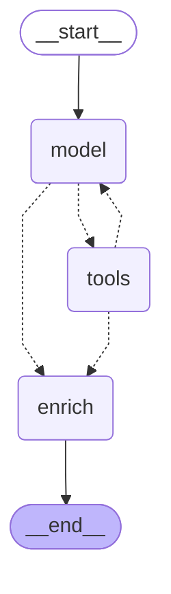

# Search graph

Generated from the compiled graph. Regenerate from the repository root:

```bash
uv run python -m scripts.export_graphs
```


```mermaid
---
config:
  flowchart:
    curve: linear
---
graph TD;
	__start__([<p>__start__</p>]):::first
	model(model)
	tools(tools)
	enrich(enrich)
	__end__([<p>__end__</p>]):::last
	__start__ --> model;
	model -.-> enrich;
	model -.-> tools;
	tools -.-> enrich;
	tools -.-> model;
	enrich --> __end__;
	classDef default fill:#f2f0ff,line-height:1.2
	classDef first fill-opacity:0
	classDef last fill:#bfb6fc

```

[Back to documentation](../README.md).
