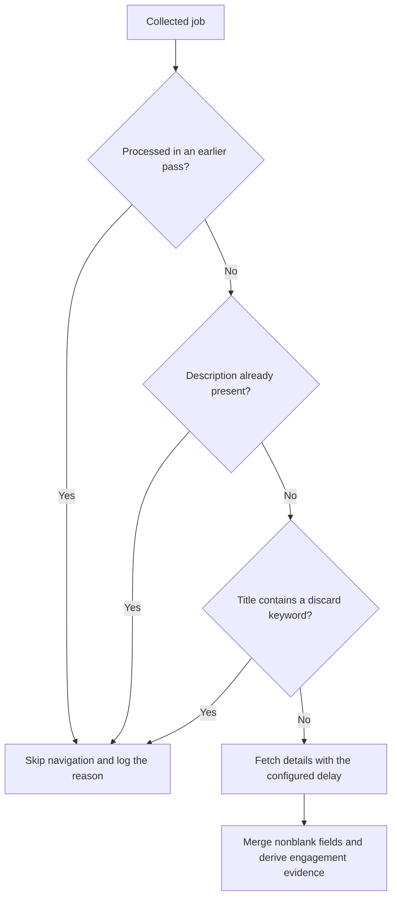

# Job evaluation and detail fetching

These changes address incorrect employment assumptions and avoid browser work that
cannot contribute a new match. They do not add model calls or change graph topology.

## Engagement versus working hours

LinkedIn's `full-time` metadata can describe weekly commitment rather than permanent
employment. The baseline run included postings with both:

```text
CONTRACT: Contractor assignment
COMMITMENT: Full-time
```

The matcher previously skipped some of these as permanent employment.
[config/employment.py](../config/employment.py) now extracts explicit role-specific
engagement evidence. `JobPosting` retains LinkedIn's `job_type` and adds
`engagement_type` and `engagement_evidence`.

| Posting evidence | Interpretation |
| --- | --- |
| `CONTRACT: Contractor assignment` with full-time metadata | Contract engagement; full-time hours do not trigger the permanent-employment blocker |
| `Employment type: Permanent` | Explicit permanent engagement |
| Bare full-time metadata | Engagement unresolved; full-time alone does not establish permanence |
| Contradictory explicit contract and permanent evidence | Unresolved; show the conflicting evidence to the matcher |
| Generic mention of working with contractors | Does not establish the advertised role's engagement |

Extraction uses labelled engagement lines and specific role phrases, with handling
for direct negation. It is deliberately limited: unusual phrasing, complex negation,
and multilingual descriptions may remain unresolved. The matcher still reads the
description and assesses other blockers; contract evidence does not guarantee a match.

[apply_job_details](../tools/search_tools.py) populates the evidence when details
arrive. [Shared job formatting](../config/job_formatting.py) includes the same
interpretation in matcher context and reports. It also derives evidence for older
objects without populated engagement fields. The [matcher prompt](../agents/matcher.py)
explicitly distinguishes full-time commitment from permanent employment.

## Detail-fetch eligibility

[tools/detail_policy.py](../tools/detail_policy.py) provides one rule used by both
the explicit detail tool and final enrichment:



The explicit tool resolves the LinkedIn job ID and requires that job to exist in
collected results. Requests for unknown jobs return feedback without navigation.
Eligible jobs are matched by ID, replacing the previous URL substring comparison.
When a fetch is skipped, the tool returns the reason and existing job data to the model.

The coordinator supplies prior-pass job IDs through `SearchContext`, along with
discard keywords and the live browser. These IDs exist only for the current run;
there is no cross-run result cache. The coordinator would discard these jobs during
deduplication, so another detail fetch would not contribute a new match.

Title filtering uses the existing comma-separated discard keywords. It skips detail
fetching without deleting the job. New title-discarded jobs still reach the matcher,
which evaluates the remaining card context. Failed or incomplete fetches leave jobs
without descriptions eligible for later enrichment; no new retry mechanism is added.

The improvement depends on query overlap and model tool choices. The
[runtime measurements](runtime-planning.md) predate this policy; a live run is needed
to measure current savings.

[Back to documentation](README.md).
