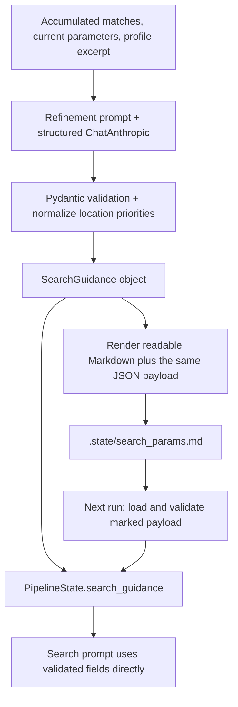

# Structured refinement and search guidance

Refinement now returns a validated `SearchGuidance` object. The coordinator passes
that object to search and separately renders `.state/search_params.md` for humans
and subsequent runs. The graph's nodes and routing remain the same.



## 1. Define the response contract

[SearchGuidance](../agents/models.py) contains:

| Field | Meaning and validation |
| --- | --- |
| `keyword_groups` | One to eight nonblank keyword combinations, in priority order |
| `experience_levels` | Supported levels: entry, associate, mid-senior, director; empty means no filter |
| `location_priorities` | Nonblank search locations in priority order; new regions are allowed |
| `insights` | Nonblank explanation of what successful and rejected jobs taught us |
| `reasoning` | Nonblank explanation of strategy changes |

Extra fields are forbidden. Date, work-mode, and job-type filters cannot be changed
through this schema. `SEARCH_LOCATIONS` supplies starting locations rather than an
allowlist. Refinement may add regions such as Europe or EMEA and must explain additions
in its reasoning. Repeated priorities are removed, ignoring letter case; new regions
are preserved. An empty priority list uses the configured starting order.
These checks validate structure and supported experience levels;
they do not guarantee that the recommended strategy will find better jobs.

## 2. Let LangChain parse the model response

[refinement.run](../agents/refinement.py) composes its prompt with the existing model:

```python
chain = _PROMPT | model.with_structured_output(
    SearchGuidance, method="function_calling", include_raw=True
)
response = chain.invoke({"session_context": context})
guidance = response["parsed"]
```

The component raises structural parsing errors and removes duplicate location priorities
before returning. It does not reject a region because it is absent from `SEARCH_LOCATIONS`.
The model callback records structured tool output, usage, and latency. Refinement
does not write files; the coordinator owns that action.

This uses [LangChain's model structured-output API](https://docs.langchain.com/oss/python/langchain/models#structured-output),
the same mechanism already used by the matcher and skills-gap component.

## 3. Hand the object directly to search

The coordinator's `refine` node stores `search_guidance` in graph state and renders
`search_params_md`. The next `search` node passes the object as `guidance=`.
[Search prompt construction](../agents/search.py) serializes those validated fields
as JSON context, without trying to extract fields from generated Markdown.

Keyword groups remain advice for the search agent; this is not a deterministic
query scheduler. Experience levels are supplied as guidance for listing calls.
The shared `effective_locations` helper puts proposed locations first and appends any
configured starting locations not already represented. For example, proposals
`["Europe", "EMEA"]` with starting locations `["Netherlands"]` produce
`["Europe", "EMEA", "Netherlands"]`. The search prompt and report use this same order.
The listing budget can stop a pass before every location is searched. Fixed date,
work-mode, and job-type URL filters still come from settings.

Search regions define where to discover postings, not where the candidate is eligible
to work. The matcher still checks whether each role accepts a Netherlands-based
candidate, even when a posting was discovered through Europe or EMEA.

## 4. Save advice for future runs

[config/search_guidance.py](../config/search_guidance.py) renders readable sections
and embeds the same object's JSON between versioned markers:

```text
<!-- search-guidance:v1 -->
... fenced JSON payload ...
<!-- /search-guidance -->
```

On a subsequent run, `parse_markdown` validates the payload back into `SearchGuidance`.
Documents without the marker use the existing freeform-text path. A malformed marked
payload raises an error instead of silently ignoring it. Saved proposed regions are
preserved on later runs; current configured starting locations are appended after them.
The structured payload is authoritative when present, so independently editing the
readable prose does not change search guidance.

This file persists search advice, not graph execution progress. Every invocation
still starts a fresh run, with no checkpointer or resume support.

## 5. Follow the change in the report

Per-iteration snapshots include the actual structured guidance handed to search,
alongside readable parameters, base criteria, starting locations, and the effective
search location order. The matched-job
report displays it under **Validated Guidance Used by Search**. This is input context;
the execution trace records the actual tool calls.

[Back to documentation](README.md).
