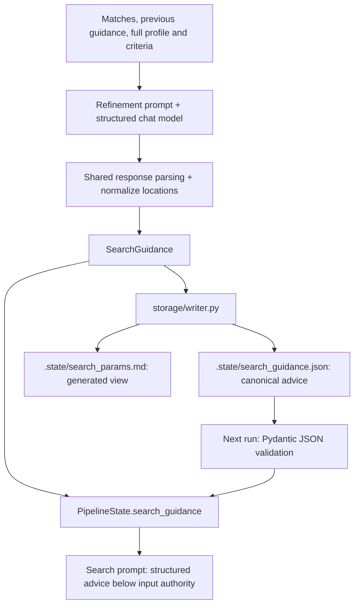

# Structured refinement and search guidance

Refinement returns a validated `SearchGuidance`. The coordinator passes it directly
to search and saves it as JSON. Markdown is a generated view, never application input.

## 1. Define the contract

[SearchGuidance](../domain/models.py) contains:

| Field | Meaning and validation |
| --- | --- |
| `keyword_groups` | One to eight nonblank keyword combinations, highest priority first |
| `location_priorities` | Nonblank search regions; additional regions are allowed |
| `insights` | Nonblank observations from matches and rejections |
| `reasoning` | Nonblank explanation of strategy changes |

Extra fields are forbidden. Date, work-mode, and job-type filters are settings and
cannot be changed through guidance. Structure validation does not guarantee that
advice improves search results or follows every user preference.

## 2. Parse the model response

[refinement.run](../agents/refinement.py) builds its local prompt and structured model.
[parse_structured_response](../agents/model_client.py) propagates parsing errors and
requires the expected Pydantic model. Refinement then removes repeated location
priorities, ignoring case. It performs no file writes.

Refinement receives representative matches from all recommendation categories. It
runs before final skills analysis, so its input does not claim to contain computed
skill gaps. The profile and criteria remain authoritative.

## 3. Hand advice directly to search

The coordinator stores the object in `search_guidance` and in the session's actual
refinement history. The next search receives it through `guidance=`. No Markdown
parsing or duplicate text representation is stored in graph state.

[effective_locations](../domain/search_guidance.py) puts proposals first, followed
by configured starting locations not already represented. `["Europe", "EMEA"]`
with `["Netherlands"]` produces `["Europe", "EMEA", "Netherlands"]`. The search
prompt and report use this order, but the listing budget can stop discovery before
all locations are searched. These are discovery regions, not candidate work permissions.

## 4. Save one canonical representation

[storage/writer.py](../storage/writer.py) saves pretty-printed JSON to
`.state/search_guidance.json`. [storage/reader.py](../storage/reader.py) loads it with
`SearchGuidance.model_validate_json`. Missing advice means search uses base criteria;
invalid or blank JSON raises an error. There are no custom markers or fence parsers.

[presentation/reports.py](../presentation/reports.py) generates `.state/search_params.md`
from the same object. Editing that view does not change application behavior.
Existing structured advice in this checkout was migrated once during the refactor.
Other old Markdown files are not loaded automatically; start from criteria or migrate
validated advice to JSON. The old runtime compatibility parser has been removed.

This stores search advice for future runs, not execution progress. Every run starts
fresh; there is no checkpoint or resume.

## 5. Inspect reports

Each search snapshot records the validated guidance, base criteria, and effective
filters. Reports also retain the actual refinement objects, including insights and
reasoning, rather than generic notifications that refinement happened. Executed
queries remain visible in the trace.

[Back to documentation](README.md).
