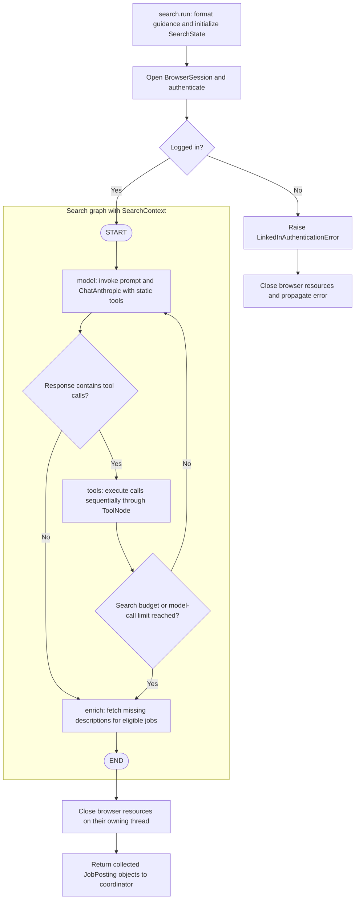
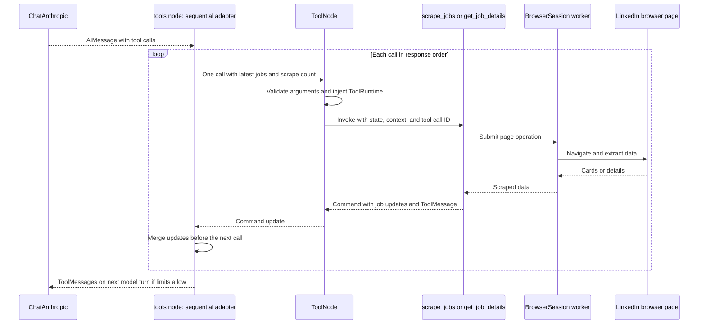

# Search workflow

The outer `search` node calls `search.run()`, which owns browser setup and cleanup
around a separate LangGraph invocation. Implementation: [agents/search.py](../agents/search.py).

Browser resources also close if a graph node raises an exception. The inner graph
is invoked inside `search.run()`; it is not registered directly as a compiled
subgraph node in the coordinator.

## A tool call and its state update

Definitions live in [tools/search_tools.py](../tools/search_tools.py). Both tools are
created once at module import and bound to the model before execution.

This sequence shows successful browser execution. A listing call whose budget is
already exhausted returns a `ToolMessage` without navigation. Invalid arguments
or an unknown tool produce error messages for the model; other execution failures
propagate. The sequential adapter ensures a later call sees earlier job and counter
updates, including remaining budget.

## State, context, and limits

- **`SearchState`:** message history, jobs keyed by ID, listing/model counters,
  token totals, and stop reason. `add_messages` merges conversation updates.
- **`SearchContext`:** supplies the live `BrowserSession`, title-discard keywords,
  and previously processed job IDs at invocation.
  `ToolRuntime` exposes it to tools without adding it to their public argument schemas.
- **Browser ownership:** [BrowserSession](../tools/browser_session.py) runs sync
  Playwright on one dedicated worker thread, including setup, navigation, and cleanup.
- **Listing budget:** at most `ceil(MAX_TOTAL_JOBS / MAX_JOBS_PER_SEARCH)` listing
  calls and at most `MAX_TOTAL_JOBS` unique collected jobs per search pass. Tools
  check this before navigation. Overlapping queries can yield fewer jobs than the cap.
- **Model budget:** at most `15` model calls. Tool calls in the final response still
  execute before routing to enrichment. Reaching a limit skips an extra summary call.
- **Enrichment:** fetches details only for jobs with a blank description whose titles
  do not contain a discard keyword and whose IDs were not processed in an earlier pass.
  The explicit detail tool uses the same rule. Skipping a fetch keeps the job in the results.
  Individual enrichment failures are logged and processing continues. Nonblank
  detail fields are merged without clearing existing values.

The stop reason is `search_budget`, `model_call_limit`, or `model_finished`.
The outer coordinator's deadline does not interrupt this inner workflow.

Return to the [application workflow](application-flow.md) or explore the
[data flow](data-flow.md).
